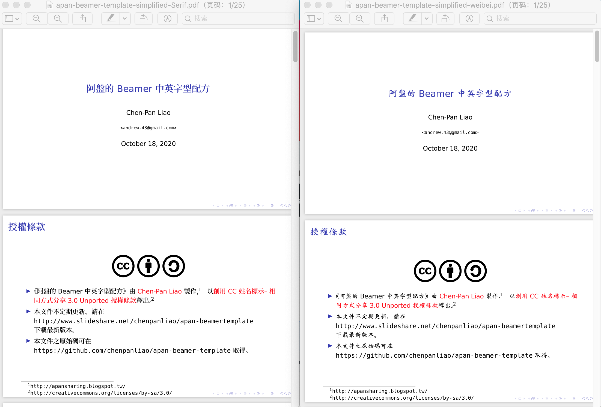
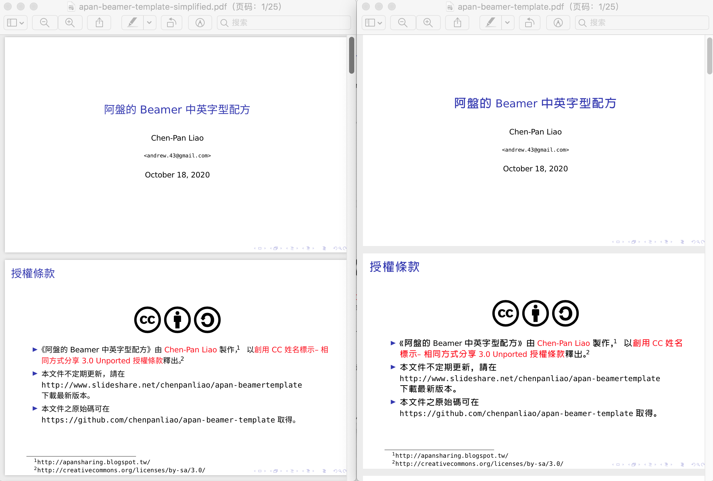

# Latex Beamer Chinese Template
Latex Beamer 中文模版

基于[阿盤的 Beamer 中英字型配方](https://www.slideshare.net/chenpanliao/apan-beamertemplate), [Github](https://github.com/chenpanliao/apan-beamer-template) 改造，原模版对简体中文支持不佳。如需使用简体中文，可以使用本模版。

## Preview

- apan-beamer-template：原始版本，对简体支持不好
- apan-beamer-template-simplified：更换字体为思源黑体
- apan-beamer-template-simplified-weibei：更换字体为魏碑字体
- apan-beamer-template-simplified-Serif：更换字体为思源宋体

预览图：

